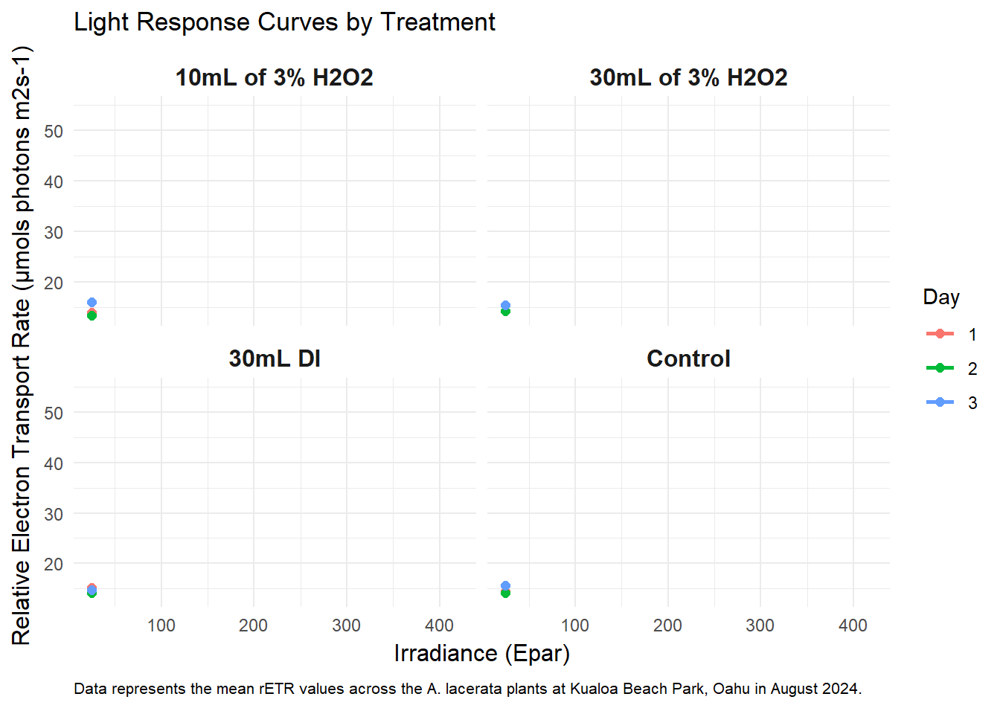

```{r setup, include=FALSE}
knitr::opts_chunk$set(echo = TRUE, error = FALSE, message = FALSE, warning = FALSE)
```

# Welcome everyone!

We're going to be learning about the invasive green algae, *Avrainvillea
lacerata*. This siphonous algae was first recorded in the late 1980s and
has spread along many of the shores surrounding Oahu, in particular the
South Shores. This alga The only successful management technique is
through physical removal of the plant. Although this technique has been
successful in the intertidal areas, it doesn't address the communities
present in deeper water areas, which has been observed in waters up to
30 meters.

This project explores the use of hydrogen peroxide as a management plan
for *Avrainvillea lacerata*. This chemical compound was selected because
H2O2 generates reactive oxygen species (ROS) that causes destruction of
vulnerable photosynthetic components.

I'm going to be looking at my dataset from Kualoa Beach Park from August
to September 2024. The purpose of this dataset was to test different
solutions and volumes in the intertidals, which will be taken to deeper
waters (20 meters).

### Load the libraries

```{r}
library(devtools) # for phytotools package
library(here) # to find files easier
library(tidyverse) # to clean data
library(phytotools) # old package
library(hash) # old package
library(dplyr) # to data wrangel
library(tidyr) # data wrangle
library(reprex)
library(lubridate) # to work with dates/time
library(ggplot2) # to plot 
library(reticulate) 
library(DT) # for interactive tables
library(knitr) # for tables
library(gganimate) # to create animated plots
```

### Load the data set in!

We're going to load in the data. This file was previously cleaned
through another script after directly downloading from the WinControl-3
software. There's another script in progress that will help you clean
files directly from WinControl-3 that you'll then be able to pass
through this script.

```{r}
kbp1 <-read_csv(here('Data', 'kbp_tran1.csv'))

```

### Data Wrangling

Here I've cleaned the data to separate and rename columns to edit based
off previous datasheets!

```{r}
cleaned_kbp <- kbp1 %>%
  separate(ID, into = c("Species", "ID", "Day"), sep = "_") %>%  # Separates field plant ID name
  mutate(Species = "Avrainvillea lacerata") %>%  # Update plant species
  select(-matches("^\\.\\.\\."), -deltaNPQ) %>%  # Removes blank columns and specified columns
  rename(
    Y.II. = `Y(II)`,  # Rename Y(II) to Y.II.
    Fm_prime = `Fm'`  # Rename Fm' to Fm_prime (avoiding issues with apostrophes)
  ) %>% 
  group_by(ID, Day) %>%
  mutate(
    Datetime = ymd_hms(paste(Date, Time))  # Combine Date and Time (optional)
  ) %>%
  ungroup() %>%
  filter(rETR > 0)  # Removes rows where rETR is NA or negative

```

Let's change the names of the treatments and replicates

```{r}
treatment <- cleaned_kbp %>%
  mutate(
    # Create a new 'Treatment' column based on the second character of 'ID'
    Treatment = case_when(
      substr(ID, 2, 2) == "a" ~ "10mL of 3% H2O2",
      substr(ID, 2, 2) == "b" ~ "30mL of 3% H2O2",
      substr(ID, 2, 2) == "c" ~ "30mL DI",
      substr(ID, 2, 2) == "d" ~ "Control",
      TRUE ~ NA_character_  # Set to NA if no match
    )
  ) %>%
  mutate(
    Treatment = factor(
      Treatment,
      levels = c("10mL of 3% H2O2", "30mL of 3% H2O2", "30mL DI", "Control")
    )
  ) %>%
  select( # Rearrange columns
    everything(),  # Keeps all columns, rearranged later
    -Date, -Time    # Remove 'Date' and 'Time' columns
  ) %>%
  select(Datetime, ID, Treatment, Day, everything())  # Move Treatment to the 3rd column


```

# **1st Output: Writing a function**

This function that will calculate our summary stats, which will make
data analysis in the future much easier. We'll write a function for the
following variables:

-   ETRmax\
-   Ek\
-   Alpha\
-   rETR

Let's get started!

*ETRmax (Maximum Electron Transport Rate)* is the peak rate at which
electrons are transported during photosynthesis under saturating light
conditions. It reflects the maximum photosynthetic capacity of an
organism.

```{r}
# Function to calculate ETRmax
calculate_ETRmax <- function(data) {
  if (!"ETR" %in% colnames(data)) {
    stop("Data must contain the column: 'ETR'")
  }
  ETRmax <- max(data$ETR, na.rm = TRUE)
  return(ETRmax)
}

```

*Ek (Photosynthetic Saturation Index)* is the light intensity at which
photosynthesis shifts from light-limited to light-saturated conditions.

```{r}
calculate_Ek <- function(ETRmax, alpha) {
  if (is.numeric(ETRmax) && is.numeric(alpha) && alpha > 0) {
    return(round(ETRmax / alpha, 3))  # Calculate and round Ek to the third decimal place
  } else {
    stop("Both ETRmax and alpha must be numeric, and alpha must be greater than 0.")
  }
}
```

*Alpha* represents the efficiency of light use during the initial stages
of photosynthesis. It is the slope of the light-response curve at low
light intensities and indicates how well an organism utilizes low light.

```{r}
# Function to calculate alpha
calculate_alpha <- function(data) {
  if (!all(c("ETR", "Epar") %in% colnames(data))) {
    stop("Data must contain the columns: 'ETR' and 'Epar'")
  }
  
  # Linear fit of the first few points to estimate alpha (slope)
  alpha <- lm(ETR ~ Epar, data = data[1:3,])$coef[2]  # Using first 3 points for the initial slope
 
   # Round the alpha value to 3 decimal places
  alpha <- round(alpha, 3)
  return(alpha)
}

```

*rETR* is the electron transport rate at specific light intensities,
scaled relative to the organism’s photosynthetic capacity.

```{r}
# Function to calculate rETR
calculate_rETR <- function(data, ETRmax) {
  if (!"ETR" %in% colnames(data)) {
    stop("Data must contain the column: 'ETR'")
  }
  
  # Calculate relative ETR for each data point
  data$rETR <- data$ETR / ETRmax
  return(data)
}

```

Apply the functions to each group of Treatment and Day to receive your
results.

```{r}
results <- treatment %>%
  group_by(Treatment, Day) %>%  # Group by Treatment and Day
  do({
    # Calculate ETRmax, alpha, Ek, and rETR for each group
    ETRmax <- calculate_ETRmax(.)
    alpha <- calculate_alpha(.)
    Ek <- calculate_Ek(ETRmax, alpha)  # Use ETRmax and alpha to calculate Ek
    rETR_data <- calculate_rETR(., alpha)
    
    # Return a summary with the calculated values
    data.frame(
      Treatment = unique(.$Treatment),
      Day = unique(.$Day),
      ETRmax = ETRmax,
      Alpha = alpha,
      Ek = Ek,
      rETR = round(mean(rETR_data$rETR, na.rm = TRUE), 3)  # Average rETR for the group

    )
  }) %>%
  ungroup()

```

# **2nd Output: Creating a Table**

Make summary results it into a table to summarise all the calculated
values from functions.

I made a customizable table using the package DT.

```{r}
results_table <- datatable(
  results, # Your data
  options = list(
    pageLength = 5,  # Number of rows per page
    dom = 'Bfrtip',  # Display options (Buttons, Filter, etc.)
    buttons = c('copy', 'csv', 'excel')  # Allow export to CSV, Excel, etc.
  ),
  rownames = FALSE,  # Hide row names
  filter = 'top'  # Enable top filtering
)

results_table

```

# **3rd Output: Writing a Function**

Writing a function for Rapid Light Curves.

This will create light curves for each treatment.

```{r}
calculate_light_curves_dataframe <- function(data) {
  # Check if required columns exist in the data
  required_columns <- c("Treatment", "Day", "Epar", "rETR")
  if (!all(required_columns %in% colnames(data))) {
    stop("Data must contain the columns: 'Treatment', 'Day', 'Epar', and 'rETR'")
  }
  
  # Filter out missing data
  filtered_data <- data %>%
    filter(!is.na(Epar), !is.na(rETR))
  
  # Calculate the light curve for each Treatment and Day
  light_curves_df <- filtered_data %>%
    group_by(Treatment, Day, Epar) %>%      # Group by Treatment, Day, and light intensity (Epar)
    summarise(
      mean_rETR = mean(rETR, na.rm = TRUE), # Calculate mean rETR
      .groups = "drop"                      # Remove grouping structure
    ) %>%
    mutate(
      Group = paste(Treatment, Day, sep = "_") # Create a unique identifier for Treatment and Day
    )
  
  return(light_curves_df)
}

```


Apply the function to view the light curves

```{r}
# Apply function to calculate light curves
light_curves_df <- calculate_light_curves_dataframe(treatment)
```

# **4th Output: Plotting**

Plotting the Rapid Light Curves. Let's plot the light curve of each
treatment over the days.

```{r}
lc_plot <- ggplot(light_curves_df, aes(x = Epar, y = mean_rETR, color = Day)) +
  geom_line(size = 1) +                    # Add lines for light curves
  geom_point(size = 2) +                   # Add points for clarity
  labs(
    title = "Light Response Curves by Treatment",
    x = "Irradiance (Epar)",
    y = "Relative Electron Transport Rate (µmols photons m2s-1)",
    caption = "Data represents the mean rETR values across the A. lacerata plants at Kualoa Beach Park, Oahu in August 2024."
  ) +
  theme_minimal() +
  facet_wrap(~ Treatment, scales = "fixed") +  # Create separate plots for each treatment
  theme(
    strip.text = element_text(size = 12, face = "bold"),  # Customize facet labels
    axis.text = element_text(size = 9),
    axis.title = element_text(size = 12),
    plot.caption = element_text(size = 8, hjust = 0) 
  )


#save the output
ggsave(here("Output", "lc_plot.png"), plot = lc_plot, width = 8, height = 6)

```

```{r}
# Animate the plot by 'Day'
animated_plot <- lc_plot + 
  transition_reveal(Epar) +  # Reveal points along the Epar axis
  enter_fade() +  # Fade in at the start of each state
  exit_fade()    # Fade out at the end of each state

```


# Save the plot!
```{r}
anim_save("animated_plot.gif", animated_plot)

# Define the path using here()
output_path <- here("Output", "animated_plot.gif")

# Save the animated plot to the specified folder
anim_save(output_path, animated_plot)
```




### **Conclusions:**

We can take this a step further and plot our Ek and write a function for
Pmax (a\*ETRmax) values, but we'll save that for another time ;)

What initally was meant to be a pilot to observe the volumes of the
impacts of hydrogen peroxide, turned out to show us that maybe using DI
as a treatment is more efficient. There's definitely more to learn!

Overall, this code has helped me streamline my data analysis and will
save time in the future after long days of diving. I'm excited to use
this in the upcoming weeks!
